# scRNA-seq Pipeline

## Overview

This repository contains an scRNA-seq analysis pipeline that processes Cell
Ranger outputs through SOLO doublet detection, QC filtering, scVI-based
integration, clustering, and cell-type annotation.

**Input:**
- Cell Ranger `filtered_feature_bc_matrix` directories, with each directory
  identified by a repository `SampleID`
- A samplesheet defining the sample IDs and associated condition metadata

**Output:**
```text
results/scRNA/
└── scRNA_data_QC_filtered_w_scVI_latent_annotated_seurat.rds
```

---

## Workflow Diagram

```mermaid
flowchart LR
    INPUT[Cell Ranger outputs and samplesheet]
    SETUP[00 Setup AnnData]
    DOUBLET[01 Doublet detection per sample]
    QC[02 QC filtering]
    SCVI[03 Train scVI]
    CLUSTER[04 Cluster and annotate]
    EXPORT[05 Export Seurat files]
    SEURAT[06 Create Seurat object]
    OUTPUT[Final Seurat object]

    INPUT --> SETUP
    SETUP --> DOUBLET
    DOUBLET --> QC
    QC --> SCVI
    SCVI --> CLUSTER
    CLUSTER --> EXPORT
    EXPORT --> SEURAT
    SEURAT --> OUTPUT
```



---

## Workflow context

### One-time reference preparation

The Drosophila reference index is generated once with `cellranger mkref` and
reused for all four samples. It forms part of the analysis provenance and is
separate from the downstream scRNA-seq analysis.

The reference-build inputs and the recorded reference details are documented
in the [`raw-data README`](./data/raw/README.md).

### Upstream Cell Ranger preprocessing

Raw reads were processed using [Cell Ranger](https://www.10xgenomics.com/support/software/cell-ranger/latest) `v6.1.2`. The per-sample
command shape is recorded in the [`raw-data README`](./data/raw/README.md).
The completed outputs should be placed in the repository at:

```text
scRNA_pipeline/data/raw/CellRanger_Outputs/<SampleID>/outs/filtered_feature_bc_matrix/
```

Here, `<SampleID>` corresponds to an entry in
[`scRNA_pipeline/data/raw/samplesheet.csv`](./data/raw/samplesheet.csv). The
repository sample IDs correspond to the Cell Ranger `--id` values, while the
original FASTQ labels (`mCherry` and `ND75`) remain separate.

### Environment

The conda environment used by the pipeline is defined in
[`environment.yml`](./environment.yml):

```bash
conda env create -f scRNA_pipeline/environment.yml
conda activate scRNA_pipeline
```

### Pipeline commands

The following commands execute the pipeline stages in order:

```bash
python scRNA_pipeline/00_setup_adata_obj.py

for sample in Control-1 ND75-KD-1 Control-3 ND75-KD-3; do
    python scRNA_pipeline/01_doublet_detection.py \
        --sample_id "$sample"
done

python scRNA_pipeline/02_QC_filtering.py
python scRNA_pipeline/03_train_scVI_model.py
python scRNA_pipeline/04_cluster_data.py
python scRNA_pipeline/05_convert_adata_to_seurat.py
Rscript scRNA_pipeline/06_convert_adata_to_seurat.R
```

---

## Pipeline Scripts

All intermediate outputs are written to
`results/scRNA/`.

| Stage | Script | Input | Outputs |
|:---|:---|:---|:---|
| 00: Setup | [`00_setup_adata_obj.py`](./00_setup_adata_obj.py) | Cell Ranger matrices and samplesheet | `<sample_id>_scRNA_data.h5ad`<br>`scRNA_raw_data.h5ad` |
| 01: Doublet detection | [`01_doublet_detection.py`](./01_doublet_detection.py) | One per-sample raw `.h5ad` file | `<sample_id>_doublet_probs.csv`<br>`<sample_id>_scRNA_data_w_doublets.h5ad`<br>`vae_models/<sample_id>/`<br>`solo_models/<sample_id>/` |
| 02: QC filtering | [`02_QC_filtering.py`](./02_QC_filtering.py) | All doublet-annotated `.h5ad` files | `batch_thresholds.csv`<br>`scRNA_data_QC_filtered.h5ad` |
| 03: scVI training | [`03_train_scVI_model.py`](./03_train_scVI_model.py) | QC-filtered `.h5ad` | `figures/scvi_training_elbo_plot.png`<br>`scVI_model_trained/`<br>`scRNA_data_QC_filtered_w_scVI_latent.h5ad` |
| 04: Clustering and annotation | [`04_cluster_data.py`](./04_cluster_data.py) | scVI latent `.h5ad` and trained model | `scRNA_data_QC_filtered_w_scVI_latent_annotated.h5ad`<br>`figures_clustering/`<br>`figures_clustering/marker_genes/`<br>`figures_clustering/umap_marker_genes/`<br>Leiden plots, UMAP/t-SNE plots, and marker tables |
| 05: Seurat export | [`05_convert_adata_to_seurat.py`](./05_convert_adata_to_seurat.py) | Annotated `.h5ad` | `seurat_conversion/` containing matrix, metadata, embedding, and neighbor-graph files |
| 06: Seurat import | [`06_convert_adata_to_seurat.R`](./06_convert_adata_to_seurat.R) | Files in `seurat_conversion/` | `scRNA_data_QC_filtered_w_scVI_latent_annotated_seurat.rds` |

---

The final Seurat object is consumed by the downstream
[`edgeR`](../edgeR/README.md) and
[`hdWGCNA`](../hdWGCNA/README.md) workflows.

---

## Dependencies

The pipeline dependencies are defined in [`environment.yml`](./environment.yml).

| Tool | Version | Purpose |
|:---|:---|:---|
| [Python](https://www.python.org/downloads/) | 3.10.17 | Pipeline scripts |
| [R](https://www.r-project.org/) | 4.4.3 | Seurat object construction |
| [Scanpy](https://scanpy.readthedocs.io/) | 1.11.1 | QC, clustering, and plotting |
| [anndata](https://anndata.readthedocs.io/) | 0.11.4 | Single-cell data containers |
| [scvi-tools](https://scvi-tools.org/) | 1.3.0 | scVI integration and SOLO doublet detection |
| [PyTorch](https://pytorch.org/) | 2.6.0 with CUDA 12.4 | scVI/SOLO backend |
| [NumPy](https://numpy.org/) | 1.26.4 | Numerical arrays |
| [pandas](https://pandas.pydata.org/) | 1.5.3 | Tabular metadata handling |
| [SciPy](https://scipy.org/) | 1.15.2 | Sparse matrices and statistics |
| [pyclustree](https://pypi.org/project/pyclustree/) | 0.4.0 | Clustering-resolution visualization |
| [Matplotlib](https://matplotlib.org/) | 3.10.1 | Plotting backend |
| [seaborn](https://seaborn.pydata.org/) | 0.13.2 | Statistical plots |
| [Seurat](https://satijalab.org/seurat/) | 5.4.0 | Seurat object construction |
| [Matrix](https://cran.r-project.org/package=Matrix) | 1.7-3 | Sparse matrix import in R |
| [ggplot2](https://ggplot2.tidyverse.org/) | 4.0.2 | Verification UMAP plots in R |
| [here](https://cran.r-project.org/package=here) | 1.0.2 | Repository-relative paths |

---

## Expected Output

All under `results/scRNA/`:

**AnnData objects**
- `<sample_id>_scRNA_data.h5ad`, `scRNA_raw_data.h5ad` — stage 00
- `<sample_id>_scRNA_data_w_doublets.h5ad` — stage 01
- `scRNA_data_QC_filtered.h5ad` — stage 02
- `scRNA_data_QC_filtered_w_scVI_latent.h5ad` — stage 03
- `scRNA_data_QC_filtered_w_scVI_latent_annotated.h5ad` — stage 04 (final annotated AnnData)

**Trained models**
- `vae_models/<sample_id>/`, `solo_models/<sample_id>/` — per-sample scVI + SOLO (stage 01)
- `scVI_model_trained/` — batch-integrated scVI model (stage 03)

**Tables**
- `<sample_id>_doublet_probs.csv` — SOLO doublet probabilities (stage 01)
- `batch_thresholds.csv` — per-batch adaptive QC cutoffs (stage 02)
- marker-gene tables (stage 04)

**Plots**
- `figures/scvi_training_elbo_plot.png` — scVI training ELBO (stage 03)
- `figures_clustering/` (with `marker_genes/` and `umap_marker_genes/` subdirectories) — Leiden, UMAP/t-SNE, and marker-gene plots (stage 04)

**Seurat export**
- `seurat_conversion/` — matrix, metadata, embedding, and neighbor-graph flat files (stage 05)
- `scRNA_data_QC_filtered_w_scVI_latent_annotated_seurat.rds` — final Seurat object (stage 06)
